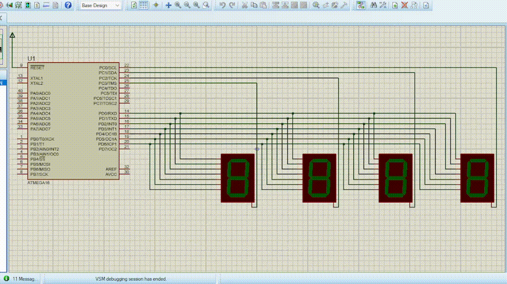

For change counter frequency, change this value:

    unsigned int overflow_max_count_1 = 5;

For change turn off/on 7segments frequency, change this value:

    unsigned int overflow_max_count_0 = 180;

:warning: Proteus can not have proper simulation at high frequency.

## Sample

