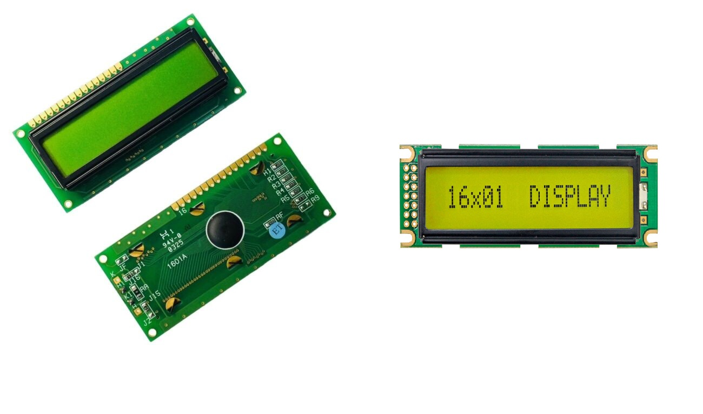
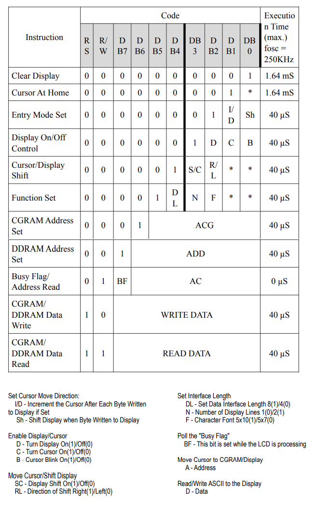

# Working with LCD

- 16x1 LCD

## **Resource** 
LCD codes and functions is [here](lcd.h)

resource: https://www.electronicwings.com/avr-atmega/lcd16x2-interfacing-with-atmega16-32

## LCD commands

