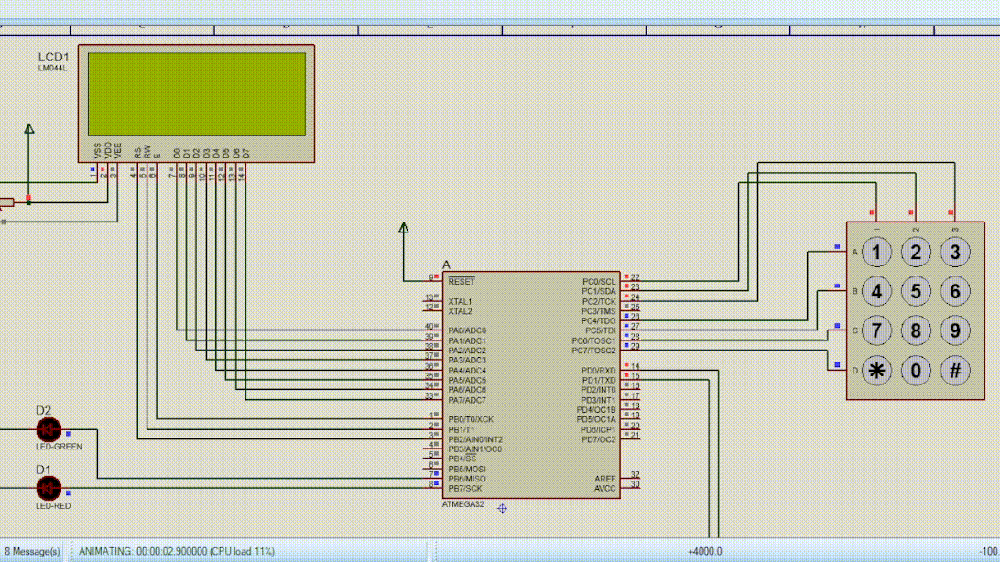

# USART
usart communication between two Atmega32 microcontroller

## circuit

## **1. Admin**

### **1.1. Admin Login and Dashboard**
    admin can login in system with this information
    - admin username: 1
    - admin password: 1234

   
### **1.2. Change Date and Clock**
    admin can change the system date and clock, the initial date is 0-1-1 and the initial clock is 0:0:0

### **1.3. Add User**
    admin can add users until the memory is full

### **1.4. Edit User**
    admin can edit user's information 

### **1.5. Delete User**
    admin can delete user's (useful when memory is full)

### **1.6. Rotate Motor**
    admin can rotate the motor, this option is common between admin and users, so we display it on the user side 

## **2. User**

### **2.1. User Login and Dashboard**
    in step 1.3 admin added the user with this information
        - username: 2
        - password: 1
    and then edited user password to 2 in step 1.4

### **2.2. Rotate Motor**
    users can rotate the stepper motor

